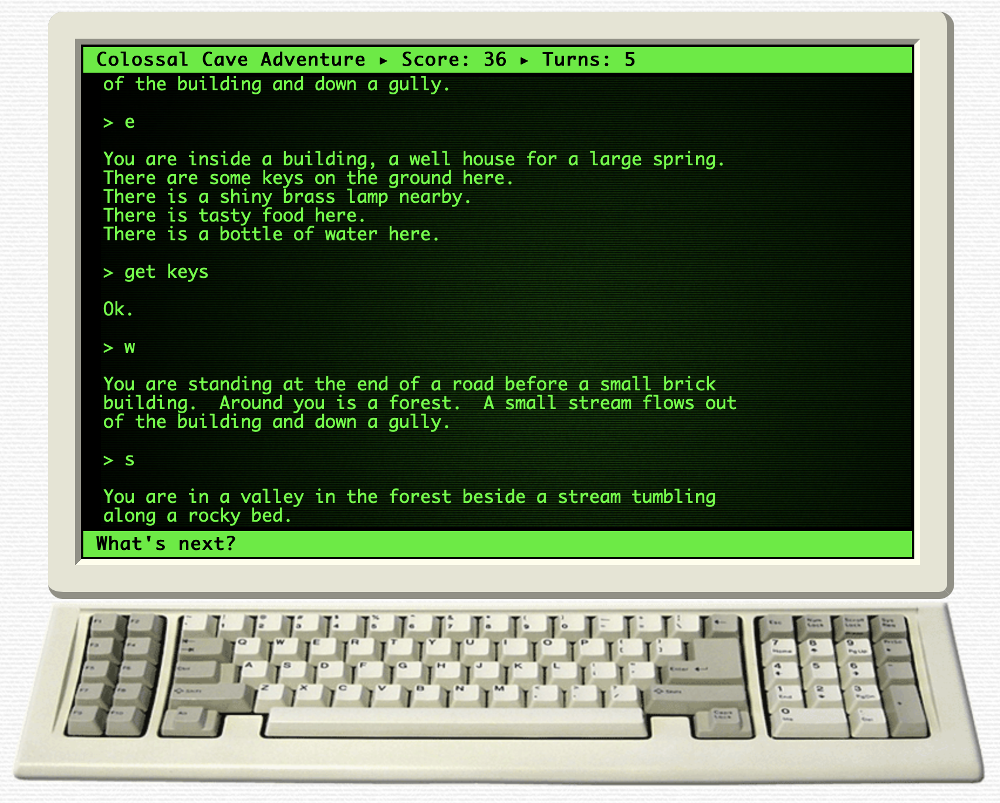

# Adventure Game

An adventure game is a simple exploration and puzzle-solving game.

Here's an example: [Colossal Cave Adventure](https://rickadams.org/adventure/advent/)



You can use the letters of cardinal directions (n, e, s, w) to move around, and simple commands, like "get torch" to put items in your inventory.

## Instructions

- Create a simple adventure game with:
    - At least 3 locations
    - An item that can be picked up and used in some way to 'win' the game
    - Clear descriptions of locations with easy to understand directions
- Begin with an outline in a text file or on a piece of paper.
- Use `input()` and `==` get and check the user's input.

```{collapse} Hint 1
Use variables to keep track of where the player is and if they're holding the game-winning object.
```

```{collapse} Hint 2
Use a `while` loop to keep the game going, where the condition of the `while` loop checks for the winning condition.
```
