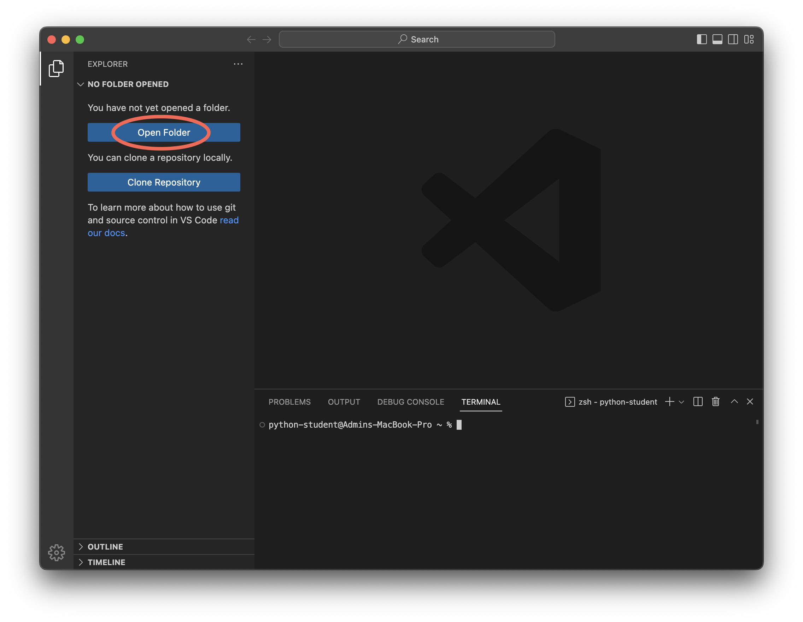
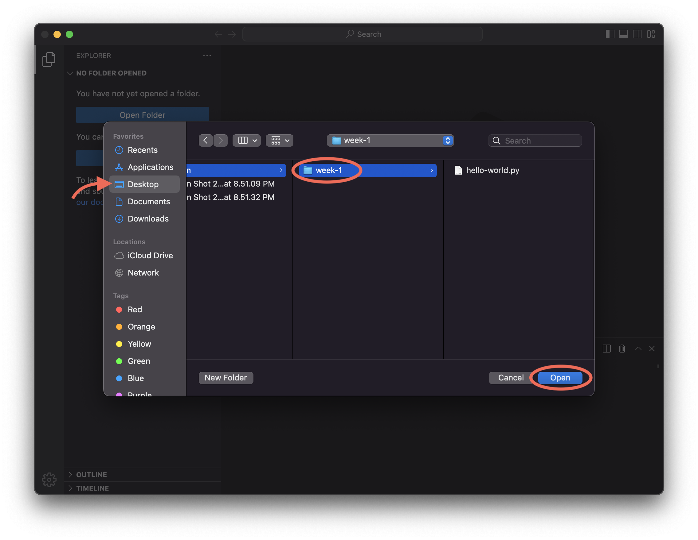

.. sectnum::

# Lab 1 — Hello, world

```{important}
Write on the board:
    sun-python-23w.github.io
```

```{important}
- Hand out laptops
- Use post-its to keep track of who has which laptop ...?
```

## Set up

1. Launch the application (should be in the dock)
1. Open the folder `week-1` in the `python` folder on the desktop.

    1. You can open the folder from VSCode by clicking *Open Folder* from the explorer, and then selecting `python` and `week-1`.
    
    

    OR

    1. You can navigate to the `week-1` folder in finder and drop it in VSCode.
    

Once your application looks like this you are ready to commence the lab!


See {ref}`vscode` for a refresher on the interface and buttons.

---


## Exercises

### Greetings

1. Start the python interactive interpreter (enter `python` in the terminal)

    You should see the interactive prompt:
    ```python
    >>>
    ```

1. Write `"Hello"` and press enter.

    Notice this string is already a value so there is nothing to evaluate and it is simply printed back out:

    ```{tip}
    We call this a _literal_, because when we define it we are _literally_ typing out the value.
    ```

1. Store `"Hello"` in a variable named `word`.

1. Type the name of the variable, `word`, and press enter.

    Notice that the output is the value _stored in_ the variable.

1. Next, assign to the variable `greeting` the result of combining `word` with a comma, a space, and your name (hint: see {ref}`combining-strings`).

    ```{caution}
    Do not type `"Hello"` out again for this step!
    ```

1. Display the value of `greeting` to check it is correct. It should look something like this:

    ```python
    >>> greeting
    'Hello, Julian'
    ```

1. Let's change up our greeting. Choose a new word you would use to greet someone and store that in the `word` variable (e.g., "Howdy", "Salutations", "Greetings", or anything you like).

1. Display the value of `greeting` again.

    Notice that the value of `greeting` _has not changed_. Take a moment to think about why this is the case.

1. Finally, define `greeting` again exactly as you did before (although the value of `word` has changed) by using the up arrow to step through your command history

1. Display `greeting` to check that it was updated.

    I stored `"Howdy"` in my `word` variable and got this output; your output should look similar but will have a different word and name:
    ```python
    >>> greeting
    'Howdy, Julian'
    ```

1. Exit the interactive interpreter by typing `exit()` and pressing enter.

<!-- Validated this exercise works as written ! -->

### Hello, world

Now that we're comfortable working in the interactive intepreter lets take a look at writing and running files.

1. Use `print()` to write a program in the file `hello-world.py` that will display **Hello, world!** when run:

    ```python
    % python hello-word.py
    "Hello, world!"
    ```

    ```{tip}
    This program will only be one line long.
    ```

    ```{note}
    The first known 'Hello world' program was written in [1974](https://en.m.wikipedia.org/wiki/%22Hello,_World!%22_program).
    ```

### Mad libs

1. Select a Mad-Libs page from the book.

1. Create a new file `madlib.py` (see {ref}`new-file` for a refresher).

1. Implement the madlib in a program:
    - Use variables to store the input words that will fill in the blanks
        - You can use `"_"` as the value of the input variables while you are working.
        - If there are multiple inputs with the same prompt you can put a number on the end (like `verb2`).
    - Use formatted string literal for the story text.
        - You can combine strings on multiple lines so long as they are inside the `print` parentheses.
        - You only need to put the first 2 or 3 sentences in your program (but you're welcome to do the whole thing!).

    Here's an example:

    ```python
    adjective = "_"
    first_name = "_"
    adjective2 = "_"
    noun = "_"

    print(
        f"They say my school is haunted! " +
        f"My {adjective} friend {first_name} says she saw " +
        f"a {adjective2} {noun} floating at the end of the " +
        f"hall near the cafeteria."
    )
    ```

1. Pair up with someone else in the class and for each of you:
    - Prompt your partner for the input words and write them as string literal in your program
    - Run the program to generate an output!

    ```python
    adjective = "disappointing"
    first_name = "Charles"
    adjective2 = "sparkling"
    noun = "goose"

    print(
        "They say my school is haunted! " +
        f"My {adjective} friend {first_name} says she saw " +
        f"a {adjective2} {noun} floating at the end of the " +
        "hall near the cafeteria."
    )
    ```

    Here's the output from running `python madlib.py`:

    ```
    They say my school is haunted! My disappointing friend Charles
    says she saw a sparkling goose floating at the end of the hall
    near the cafeteria.
    ```

### Feedback

Please fill navigate to the **Feedback** form listed under **Resources** in the sidebar and submit:
- 1 thing that went well today
- 1 suggestion for how I can make the class better

Check in with me before moving on to the challenges section.

---

## Challenges

<!-- ```{note}
These can be done in any order; if you get stuck try a different one!
```

### Text art

1. Visit [this site](https://www.texttoascii.com/text-art) to generate text art that says **Hello, world!**
1. Use the text art and modify your `hello-world.py` to print out the art in the terminal.

Here's an example:

```plaintext
% python hello-world.py

    dMP dMP dMMMMMP dMP     dMP    .aMMMb        dMP dMP dMP .aMMMb  dMMMMb  dMP     dMMMMb
   dMP dMP dMP     dMP     dMP    dMP"dMP       dMP dMP dMP dMP"dMP dMP.dMP dMP     dMP VMP
  dMMMMMP dMMMP   dMP     dMP    dMP dMP       dMP dMP dMP dMP dMP dMMMMK" dMP     dMP dMP
 dMP dMP dMP     dMP     dMP    dMP.aMP       dMP.dMP.dMP dMP.aMP dMP"AMF dMP     dMP.aMP
dMP dMP dMMMMMP dMMMMMP dMMMMMP VMMMP"        VMMMPVMMP"  VMMMP" dMP dMP dMMMMMP dMMMMP"

```

Hint: It may be helpful to split the string into multiple lines using parentheses, and to use newlines (see {ref}`newlines`):

```python
long_string = ("first line\n" +
               "second line\n")
```

```{tip}
In order to differentiate `\n` from a real usecase, like `C:\\users\nancy`, Python allows you to write the special character `\\` and will print this as a single `\`. If your text art has multiple backslashes in a row you will need to replace each single backslash with a pair or else Python will think you are trying to write the special character `\\`.
``` -->

### Colors

Read the blog post [Build your own Command Line with ANSI escape codes](https://www.lihaoyi.com/post/BuildyourownCommandLinewithANSIescapecodes.html) and put colors into your madlibs program so that the final output displays each type of word inserted in a different color (for example, green corresponds to verb, yellow to noun, etc.).


```{important}
If everyone finishes the lab early:

- (10-15 minutes) explain `input()` and have people augment their mad libs program
- (5 minutes) start a discussion:
    - What did people learn?
    - What was hard?
    - What can we improve for next time?
```
