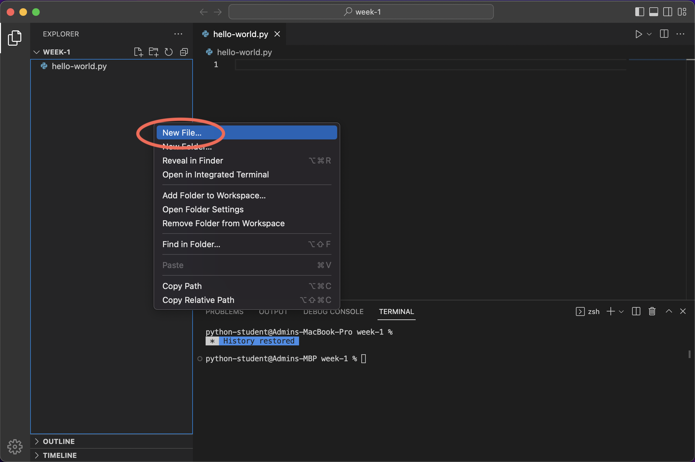

# Lecture 1 — Introduction to Python

```{important}
## Warm up

- Circle up and introduce
    - Name
    - Favorite game—video game, board game, sport, etc.

TIMECHECK: 7 minutes

## Introduction

- Course overview
    - Goals
        - Have fun
        - Make some cool projects
        - Learn general programming concepts
        - Gain an understanding of the Python language
    - Disclaimer
        - This is my first time teaching this
        - We may not get to all the material I prepared for today and _that's ok_
        - I'm learning from this as much as all of you / y'all are
        - Feedback form on the website
    - What to do if stuck / confused
        - Check the lecture notes
        - Ask someone next to you
        - Raise hand / get my attentio

Timecheck: 10 minutes

## Fill out a madlib as a group

Timecheck: 15 minutes
```

(vscode)=
## VSCode

VSCode is a popular choice of application for developing Python that lets us browse files, edit text, see problems with code in real time, and execute programs.


The interface has 3 main regions, shown in purple, green, and orange:


1. The file explorer (purple 🟪)
    - Shows a tree view of the current folder
    - Selecting a file here will open it in the editor
    - Can be opened/closed by pressing either button circled in purple
1. The editor (green 🟩)
    - Where we interact with files and write code
1. Console area (orange 🟧)
    - Shows outputs from our code
    - Can be opened/closed by clicking the top right button circled in orange
    - Has 4 different tabs but we will only use the "Terminal" tab (red 🟥)
        - The terminal lets us run commands and see output

Other elements of the interface:
- The arrows in the top bar (<- ->) navigate back / forward through editors
- The gear (⚙️) in the bottom left corner opens settings

## The Interactive Interpreter (Console)

Python has an interactive interpreter that allows you to type code and immediately see the result of evaluating that line.

We can launch the interpreter by running the command `python` in the terminal (see {ref}`vscode` if you're not sure where the terminal is):
```text
% python
Python 3.11.1 ... (a bunch of debug info)
Type "help", "copyright", "credits" or "license" for more information.
>>>
```

Here’s an example of adding two numbers in the interpreter:

```python
>>> 1 + 1
2
```

Pressing the return key tells Python to evaluate the line.

### Exiting

When you are finished using the interpreter, type `exit()` and press the return key to exit the interpreter.

```python
>>> exit()
```

(syntax)=
## Syntax

_Syntax_ is the term we use to describe the specific characters, symbols, spacing, or combinations of characters/symbols/spaces that we need to use for a programming language to understand what we are saying. Programming languages are much less skilled at understanding written text than humans, so we need to be very precise for them to understand.

### Examples in English

We can apply the concept of syntax to english writing to ground the idea of syntax in some concepts you may already be familiar with:

- Sentences must start with a capital letter, and must end with `.`, `?`, or `!`.

    ```
    This is a sentence.
    This sentence coveys excitement!
    Does this sentence ask a question?
    ```

    - This rules help us easily understand where sentences begin and end, and allows us to skip ahead or backwards by looking for punctuation and capitalization.

- Peoples name's are capitalized.

    ```
    Bobby
    Will
    Sofia
    ```

    - This rule helps us know if a word like 'White' is someone's last name, or a color, for instance; the phrases "the Rich family" versus "the rich family" have a different meaning.

### Examples in Python

For example, the python syntax for adding two numbers is to write each number with a plus symbol (`+`) in between, with any amount of spaces optionally included between the plus symbol and the numbers.

These are all valid syntaxes (and have the same meaning):
```python
>>> 1+1
2
>>> 1 + 1
2
>>> 1 +1
2
```

However, these do not follow the syntax and are invalid:
```python
>>> 1 1 +
  File "<stdin>", line 1
    1 1 +
      ^
SyntaxError: invalid syntax
```

```python
>>> + 1 1
  File "<stdin>", line 1
    + 1 1
        ^
SyntaxError: invalid syntax
```

## Strings

"String" is another word for "text" (because text is just a _string_ of characters all _strung_ together in a row).

Sentences and words and letters are all strings, but numbers can be strings too! Strings can contain any displayable character you can type with a keyboard. These are all strings:
```python
"This is a string!"
"@#///$!"
"87"
"---"
":)"
```

(combining-strings)=
### Combining strings

We can combine multiple strings into one using the plus symbol, `+`:
```python
>>> "abc" + "def"
'abcdef'
```

This might be useful for constructing a date:
```python
>>> "January" + "16th" + "2023"
'January16th2023'
```

We can add some spaces to make it look a little nicer:
```python
>>> "January" + " " + "16th" + ", " + "2023"
'January 16th, 2023'
```

(failed-concatenation)=
#### What about using `+` with numbers?

What happens if we try to build a date using a number?

```python
>>> "January" + " " + 16 + "th"
Traceback (most recent call last):
  File "<stdin>", line 1, in <module>
TypeError: can only concatenate str (not "int") to str
```

We get an error! The message "can only concatenate str (not 'int') to str" is telling us that the plus operator, `+`, is not defined when providing a string and a number (although we can combine 2 strings or 2 numbers with `+`).

However, there is a simple way to combine numbers and strings...

(f-strings)=
### Formatted string literals

A _formatted string literal_ (or "format string" for short) allows us to insert things (literals, variables, or expressions) into our strings:

```python
>>> name = "Yoda"
>>> height = 0.66  # meters
>>> f"{name} is {height * 39.37} inches tall and {900} years old!"
'Yoda is 25.9842 inches tall and 900 years old!'
```

```{tip}
See {ref}`syntax` for a refresher on what "syntax" means.
```

The syntax for formatted string literals is as follows:
- Put an `f` right before the first quote (no spaces)
- Surround any variables, literals, or expressions with curly braces, `{` and `}`

Now we can construct our date from above ({ref}`failed-concatenation`):
```python
>>> f"January {16}th"
'January 16th'
```

```{caution}
Do not put any literal strings inside format string or Python will get confused!

    >>> f"Hello, {"world"}"
      File "<stdin>", line 1
        f"Hello, {"world"}"
                ^^^^^
    SyntaxError: f-string: expecting '}'

```

## Variables

While literals are often necessary in a program, they are not very dynamic. Variables allow us to:
- Store a value,
- Access the value later, and even
- Change the value as many times as we want!

### Example

```python
>>> points = 0

>>> f"I have {points} points!"
'I have 0 points!'

>>> points = 100000

>>> f"I have {points} points!"
'I have 100000 points!'
```
(I added the extra newlines to try to make each separate step more clear.)

### Syntax

To store a value in a variable we write the name of the variable, the equals sign, and then the value:
```python
>>> x = 32
```

The spaces around the `=` are optional, but highly encouraged!

To access the value stored in a variable, we just write the name of the variable:
```python
>>> x * 2
64

>>> y = x / 2
>>> y
16
```

You can assign a new value to a variable as many times as you want!
```python
>>> x = 3200
```

### Naming

1. Variable names can contain any of these characters:
    - Lowercase letters (`a`, `b`, ... , `z`)
    - Uppercase letters (`A`, `B`, ... , `Z`)
    - An underscore (`_`)
    - Numbers (`0`, `1`, ... `9`)
2. Variable names *may not begin with a number*.

```{important}
- What about using a `-` symbol (e.g., `my-variable`)?
    - ASK: Why doesn't this work
    - This is the syntax for subtracting two variables called `my` and `variable`
```

```{important}
Skip in lecture ...
```

3. Python reserves some special names for itself that you are not allowed to use as names for your variables:

    ```text
    False      await      else       import     pass
    None       break      except     in         raise
    True       class      finally    is         return
    and        continue   for        lambda     try
    as         def        from       nonlocal   while
    assert     del        global     not        with
    async      elif       if         or         yield
    ```

```{important}
... skip in lecture.
```


#### Examples

Here are some examples of valid names:

```yaml
x
count
power_level
```

Here are some names that will cause errors

```yaml
1person      # Variable names cannot start with a number
class        # The name `class` is reserved by Python
my-variable  # The hyphen will be interpreted as a minus sign
```

#### Best practices

- Write variable names all lower case letters.
- If a variable name contains multiple words, connect them with underscores—we can't use spaces or python would think each word was a variable name:
    ```python
    days_in_a_year = 365
    ```

## Working with Files

The interactive interpreter is a convenient way to experiment and iterate on ideas quickly, but is challenging to reuse.

Alternatively, we can write a series of lines in a file and then evaluate that file all at once.

Here's an example, in a file:
```python
current_year = 2023
message = f"The year is {current_year}"
```

(new-file)=
### Creating a new file in VSCode

To create a new file in VSCode:
1. Right click in the file explorer area (left hand side) underneath the existing files (currently `hello-world.py`).
    
1. Select `New file...`
1. Type in a name (ending in `.py`)
1. Press enter

### Running a program

In the terminal, run `python <file name>`, where `<file name>` is the name of the file you authored (for example, `year.py`):
```
% python year.py
```

Unfortunately our program doesn't have any output, but in the next section we'll see how we can output to the screen!


(printing)=
## Printing

Unlike the interactive interpreter, running a script does not automatically display a value. In order to display values we can use the `print` function. This script:

```python
print("Hi!")
```

Will produce the following output when run:

```
Hi!
```

```{tip}
`print` is a function, which we *invoke* (tell it to run) using parenthesis.
```

It can be very powerful to combine format string literals with print:
```python
print(f"My name is {the_real_slim_shady}")
```

<!-- (newlines)=
## Newlines in Strings

If we try typing a newline inside of a string literal by pressing the return key python will try to evaluate that line by itself, and report at error because there is a `"` missing on the right side of the string:

```python
>>> "This is my first line.
  File "<stdin>", line 1
    "This is my first line.
    ^
SyntaxError: unterminated string literal (detected at line 1)
```

Instead we use the special character `\n` to tell python to put a newline there:

```python
print("This is my first line.\nThis is my second line")
```

This produces the output:

```shell
This is my first line.
This is my second line
``` -->
