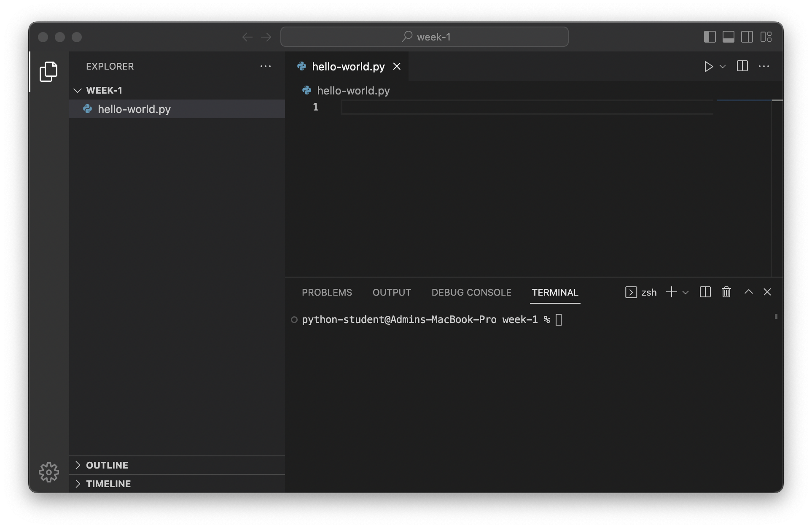
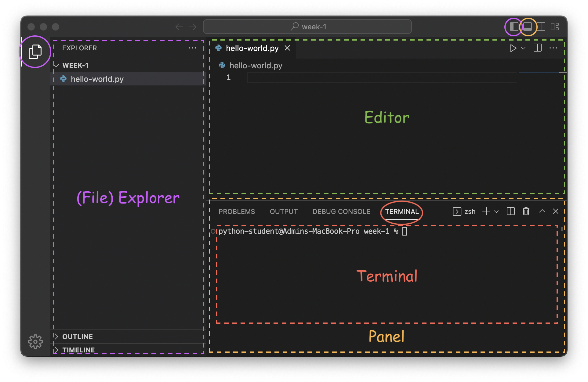

# Lecture Notes
<!-- 90 minutes total; 15 minute warm-up and 45 minute lab? -->

## Warm up

<!-- TODO: Need to do some sort of 'community building' thing for ~15 minutes-->

- Circle up and introduce names + some fun fact
- Name point & swap game


```{important}
TIMECHECK: 10 minutes
```

## Introduction (5min)

- Instructor introduction
- Course overview
- Discuss thinking about the terminal as an "interface" ?
    - Colors
    - Emojis

```{important}
⏰ 15 minutes
```

## Introduction to Python

(vscode)=
### VSCode

VSCode is a popular choice of _integrated development environment_ (IDE) for developing Python.



The interface has 3 main regions:




1. The file explorer (purple)
    - Shows a tree view of the current folder
    - Selecting a file here will open it in the editor
    - Can be opened/closed by pressing either button circled in purple
1. The editor (green)
    - Where we interact with files and write code
1. Console area (orange)
    - Has 4 different tabs but we will only use the "Terminal" (red)
    - Can be opened/closed by clicking the top right button circled in orange

Other elements of the interface:
- The arrows in the top bar (<- ->) navigate back / forward through editors
- The gear (⚙️) in the bottom left corner opens settings


### The Interactive Interpreter (Console)

Python has an interactive interpreter that allows you to type code and immediately see the result of evaluating that line.

We can launch the interpreter by running the command `python` in the terminal (see {ref}`vscode` if you're not sure where the terminal is):
```text
% python
Python 3.11.1 ... (a bunch of debug info)
Type "help", "copyright", "credits" or "license" for more information.
>>>
```

Here’s an example of adding two numbers in the interpreter:

```python
>>> 1 + 1
2
```

Pressing the return key tells Python to evaluate the line.

#### Exiting

When you are finished using the interpreter, type `exit()` and press the return key to exit the interpreter.

```python
>>> exit()
```

### Strings


### Scripts — Writing and Running Files

The interactive interpreter is a convenient way to experiment and iterate on ideas quickly, but is challenging to reuse.

Alternatively, we can write a series of lines in a file and then evaluate that file all at once.

- Instructions for the command line

    From the command line, run `python <file name>`, where `<file name>` is the path to the file you authored.


### Printing

Unlike the interactive interpreter, running a script does not automatically display a value. In order to display values we can use the `print` function. This script:

```python
print("Hi!")
```

Will produce the following output when run:

```
Hi!
```

```{tip}
`print` is a function, which we *invoke* (tell it to run) using parenthesis.
```

> ⏰ 30 minutes

## Lab 1: Hello, world


> ⏰ 40 minutes

## Variables and input

### Variables

#### Naming Rules

1. Variable names can contain any of these characters:
    - Lowercase letters (`a`, `b`, … , `z`)
    - Uppercase letters (`A`, `B`, … , `Z`)
    - An underscore (`_`)
    - Numbers (`0`, `1`, … `9`)
2. Variable names *may not begin with a number*.
3. Python reserves some special names for itself that you are not allowed to use as names for your variables:

    ```
    False      await      else       import     pass
    None       break      except     in         raise
    True       class      finally    is         return
    and        continue   for        lambda     try
    as         def        from       nonlocal   while
    assert     del        global     not        with
    async      elif       if         or         yield
    ```


##### Examples

Here are some examples of valid names:

```python
x = 1
count = 2
Amount = 23
TOTAL = 100
_power_level = 9001
person1 = "jeremy"
person2 = "bob"
```

Here are some names that will cause errors

```yaml
1person = "tim"  # Variable names cannot start with a number
class = "fun"    # The name `class` is reserved by Python
my-variable = 1  # The hyphen will be interpreted as a minus sign
```

#### Naming Conventions

...

### Advanced Strings

- string operations (incl. interpolation ?)


<!-- May or may not get to this ? -->

### Input


> ⏰ 55 minutes

## Lab 2: Mad libs (30min)

- stretch: ascii art and ANSI colors ?
- stretch: ???


> ⏰ 85 minutes


## (If time allows) Comments

A _comment_ is a line that is ignored by the interpreter and can contain any text. A line is a comment if there is a hashtag, `#` (or "_octothorp_"), at the beginning of the line. Here’s an example:

```python
# This is a comment!
```

We generally use comments for:

- Providing context
- Explaining why a decision was made
- Documenting the inputs and outputs to a function or program

By convention, we put comments *before* the line that they reference. Here’s an example:

```python
# This computes an approximation for pi
# See: https://en.wikipedia.org/wiki/Leibniz_formula_for_π
(1 - 1/3 + 1/5 - 1/7) * 4
```

*Note: It is always a good idea to cite sources and provide links when borrowing formulas or code from elsewhere.*
